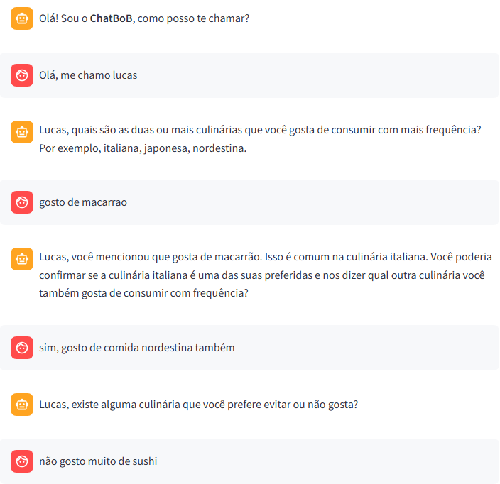
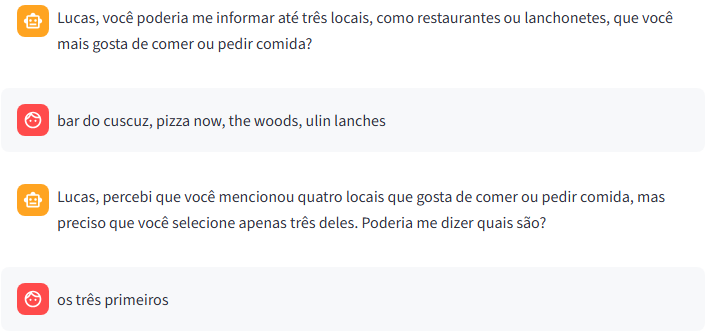
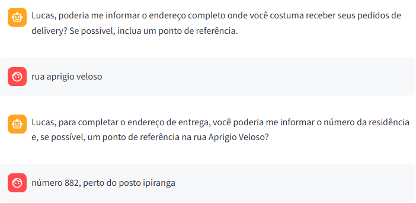
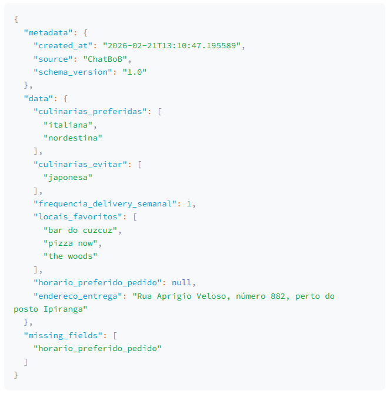

# ChatBoB - Agente Conversacional Genérico Guiado por Esquema Baseado em Arquitetura Multiagente para Extração de Informações

Um agente inteligente projetado para extrair dados estruturados a partir de conversas naturais. Ele atua fazendo perguntas estratégicas ao usuário para preencher um schema JSON pré-definido, lidando com restrições, validações e normalização de dados automaticamente.

---

## 🚀 Funcionalidades

- **Extração Baseada em Schema**: Utiliza um padrão JSON Schema recomendado (`description`, `type`, `required`) para guiar a extração com precisão.
- **Questionamento Dinâmico**: O agente decide qual pergunta fazer com base nos campos que faltam (`missing_fields`).
- **Gestão de Restrições**: Respeita regras lógicas (ex: só perguntar X se Y for respondido).
- **Validação e Normalização**: Converte respostas coloquiais (ex: "gosto de rock") em dados estruturados (ex: `["rock"]`).
- **Agnóstico de Interface**: Pode ser usado com Streamlit, API REST, CLI ou qualquer outra interface.

---

## 🧠 Como o Agente Atua

O fluxo de trabalho do agente segue um ciclo contínuo de análise e interação:

1.  **Recebe o Schema**: O agente carrega as definições dos campos (tipos, descrições, obrigatoriedade).
2.  **Analisa o Estado**: Verifica o histórico da conversa e identifica quais campos obrigatórios ainda estão vazios.
3.  **Decide a Próxima Ação**:
    *   Se faltam dados: Gera uma pergunta natural para o usuário.
    *   Se o usuário respondeu: Extrai as informações, valida e atualiza o JSON final.
4.  **Verifica Restrições**: Antes de perguntar, checa se as pré-condições do campo foram atendidas (dependências entre campos).
5.  **Finaliza**: Quando todos os campos obrigatórios estão preenchidos, entrega o JSON estruturado.

---

## 🛠️ Configuração e Instalação

### Pré-requisitos

- Python 3.10+
- Chave de API da OpenAI (ou outra LLM configurada)

### Instalação

1. Clone o repositório:
   ```bash
   git clone https://github.com/lucasemmanuelsa/ChatBoB.git
   cd ChatBoB
   ```

2. Instale as dependências:
   ```bash
   pip install -r requirements.txt
   ```

3. Configure as credenciais:
   Este projeto usa `streamlit.secrets` por padrão. Crie um arquivo `.streamlit/secrets.toml`:

   ```toml
   open_ai_key = "sk-..."
   ```

   > **Nota:** Para uso fora do Streamlit, certifique-se de configurar a variável de ambiente `OPENAI_API_KEY` ou adaptar o arquivo `app/core/llm.py`.

---

## 🖥️ Executando a Demo (Streamlit)

O projeto inclui uma interface gráfica para testar o agente em tempo real.

```bash
streamlit run demo/streamlit_app.py
```

Isso abrirá uma interface de chat onde você pode interagir com o agente e ver o JSON sendo construído ao vivo.

---

## 💻 Guia do Desenvolvedor: Uso Programático

O `Chat Data Extractor` foi desenhado para ser modular. Você pode integrar o `ExtractorAgent` em sua própria aplicação (backend API, bot de Discord/WhatsApp, CLI) sem depender do Streamlit.

### Exemplo de Implementação

Aqui está como instanciar e usar o agente diretamente em Python:

```python
from app.core.extractor import ExtractorAgent, Schema

# 1. Defina o Schema (pode vir de um arquivo JSON também)
# Exemplo de schema simplificado
schema_dict = {
  "nome": {
    "type": "string", 
    "description": "Nome do usuário", 
    "required": True
  },
  "idade": {
    "type": "integer", 
    "description": "Idade do usuário", 
    "required": True
  }
}
meu_schema = Schema(schema_dict) 
# Ou Schema.load_from_file("schema.json")

# 2. Inicialize o Agente
agent = ExtractorAgent(schema=meu_schema)

# 3. Inicialize o Estado da Conversa
# O estado mantém o histórico e o progresso da extração
state = {
    "last_user_message": "",
    "schema": meu_schema,
    "extracted": {},
    "missing_fields": [],
    "context_messages": [],
    "status_finished": False,
    "logs": []
}

# 4. Loop de Conversação (Simulação CLI)
user_inputs = ["Olá", "Me chamo Lucas", "Tenho 25 anos"]

print("--- Iniciando Sessão ---")
for msg in user_inputs:
    print(f"User: {msg}")
    
    # Alimenta a mensagem no grafo do agente
    result_state = agent.feed_message(msg, state)
    
    # Atualiza o estado com o retorno
    state.update(result_state)
    
    # Acessa a pergunta gerada ou o JSON final
    if state.get("question_to_ask"):
        print(f"Agent: {state['question_to_ask']}")
    
    # Verifica se terminou
    if state.get("status_finished"):
        print("\n--- Extração Completa! ---")
        print(state["final_json"])
        break
```

---

## 📂 Exemplo Prático: Coletor de Preferências Culinárias

Para ilustrar o poder do agente, utilizamos um **Schema Culinário** completo, exigindo preferências, restrições e endereços.

### 1. Schema de Entrada (`schema.json`)
Definimos os campos que queremos extrair, suas descrições e regras de obrigatoriedade.

```json
{
  "culinarias_preferidas": {
    "description": "Duas ou mais culinárias que o usuário gosta de consumir com mais frequência (ex: italiana, japonesa, nordestina).",
    "type": "List",
    "required": true
  },
  "culinarias_evitar": {
    "description": "Uma ou mais culinárias que o usuário evita ou não gosta.",
    "type": "List",
    "required": true
  },
  "frequencia_delivery_semanal": {
    "description": "Número aproximado de vezes por semana que o usuário pede comida por delivery.",
    "type": "Number",
    "required": true
  },
  "horario_preferido_pedido": {
    "description": "Período do dia em que o usuário costuma pedir comida (manhã, tarde, noite).",
    "type": "String",
    "required": false
  },
  "endereco_entrega": {
    "description": "Endereço completo onde o usuário costuma receber pedidos.",
    "type": "String",
    "required": true
  }
}
```

### 2. Interação Natural (Exemplo de Chat)
O agente conduz a conversa de forma fluida para preencher o schema.





### 3. Resultado Gerado (JSON Final)
Ao final da conversa, o agente gera um JSON estruturado e validado, pronto para ser consumido por uma API ou banco de dados.



---

## 📁 Estrutura do Projeto

```
chat-data-extractor/
├── app/
│   ├── core/           # Lógica central (LLM, Agente, Schema)
│   └── graph/          # Definição do Grafo (LangGraph)
├── demo/               # Interface Streamlit
├── conversation_logs/  # Histórico salvo das sessões
├── requirements.txt    # Dependências
└── README.md           # Documentação
```

A arquitetura utiliza **LangGraph** para gerenciar o fluxo de estado, permitindo ciclos complexos de decisão (ex: verificar se falta informação -> perguntar -> extrair -> verificar novamente) de forma robusta e tipada.
