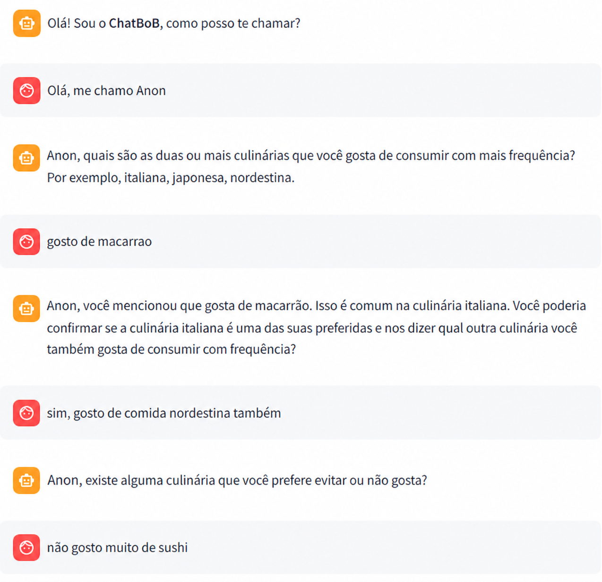

# ChatBoB - Generic Schema-Guided Conversational Agent Based on a Multi-Agent Architecture for Information Extraction

An intelligent agent designed to extract structured data from natural conversations. It interacts with users by asking strategic questions to fill a predefined JSON schema, automatically handling constraints, validation, and data normalization.

---

## 🚀 Features

- **Schema-Based Extraction**: Uses a recommended JSON Schema pattern (`description`, `type`, `required`) to guide accurate information extraction.
- **Dynamic Questioning**: The agent decides which question to ask next based on missing fields (`missing_fields`).
- **Constraint Management**: Respects logical rules (e.g., only asks field X if field Y has already been answered).
- **Validation and Normalization**: Converts natural responses (e.g., *"I like rock music"*) into structured data (e.g., `["rock"]`).
- **Interface Agnostic**: Can be integrated with Streamlit, REST APIs, CLI applications, or any other interface.

---

## 🧠 How the Agent Works

The agent follows a continuous analysis and interaction cycle:

1. **Load the Schema**  
   The agent reads the field definitions (types, descriptions, and required fields).

2. **Analyze the Current State**  
   It checks the conversation history and identifies which required fields are still missing.

3. **Decide the Next Action**
   - If data is missing: generates a natural follow-up question.
   - If the user answered: extracts the information, validates it, and updates the final JSON.

4. **Check Constraints**  
   Before asking a question, it verifies whether field preconditions have been satisfied (field dependencies).

5. **Finish**  
   Once all required fields are filled, the agent returns the final structured JSON.

---

## 🛠️ Setup and Installation

### Prerequisites

- Python 3.10+
- OpenAI API key (or another configured LLM provider)

---

### Installation

1. Clone the repository:

2. Install dependencies:

```bash
pip install -r requirements.txt
```

3. Configure credentials:

This project uses `streamlit.secrets` by default. Create a file named `.streamlit/secrets.toml`:

```toml
open_ai_key = "sk-..."
```

> **Note:** If running outside Streamlit, configure the `OPENAI_API_KEY` environment variable or adapt the `app/core/llm.py` file.

---

## 🖥️ Running the Demo (Streamlit)

The project includes a graphical interface for testing the agent in real time.

```bash
streamlit run demo/streamlit_app.py
```

This opens a chat interface where you can interact with the agent and observe the JSON being built live.

---

## 💻 Developer Guide: Programmatic Usage

`ChatBoB` was designed to be modular. You can integrate `ExtractorAgent` into your own application (backend API, Discord/WhatsApp bot, CLI, etc.) without depending on Streamlit.

---

### Example Implementation

```python
from app.core.extractor import ExtractorAgent, Schema

# 1. Define the Schema (can also be loaded from a JSON file)
schema_dict = {
  "name": {
    "type": "string",
    "description": "User's name",
    "required": True
  },
  "age": {
    "type": "integer",
    "description": "User's age",
    "required": True
  }
}

my_schema = Schema(schema_dict)
# or Schema.load_from_file("schema.json")

# 2. Initialize the Agent
agent = ExtractorAgent(schema=my_schema)

# 3. Initialize the Conversation State
state = {
    "last_user_message": "",
    "schema": my_schema,
    "extracted": {},
    "missing_fields": [],
    "context_messages": [],
    "status_finished": False,
    "logs": []
}

# 4. Conversation Loop (CLI simulation)
user_inputs = ["Hello", "My name is Anon", "I am X years old"]

print("--- Starting Session ---")

for msg in user_inputs:
    print(f"User: {msg}")

    result_state = agent.feed_message(msg, state)
    state.update(result_state)

    if state.get("question_to_ask"):
        print(f"Agent: {state['question_to_ask']}")

    if state.get("status_finished"):
        print("\n--- Extraction Complete! ---")
        print(state["final_json"])
        break
```

---

# 📂 Practical Example: Culinary Preferences Collector

To demonstrate the agent’s capabilities, we use a **Culinary Preferences Schema**, which requires collecting preferences, restrictions, delivery habits, and address information.

---

## 1. Input Schema (`schema.json`)

We define the fields we want to extract, their descriptions, and validation requirements.

```json
{
  "favorite_cuisines": {
    "description": "Two or more cuisines that the user likes to consume most frequently (e.g., Italian, Japanese, Brazilian Northeastern cuisine).",
    "type": "List",
    "required": true
  },

  "cuisines_to_avoid": {
    "description": "One or more cuisines that the user avoids or does not like.",
    "type": "List",
    "required": true
  },

  "weekly_delivery_frequency": {
    "description": "Approximate number of times per week that the user orders food delivery.",
    "type": "Number",
    "required": true
  },

  "favorite_places": {
    "description": "Up to three places (restaurants, snack bars, or food establishments) where the user most enjoys eating or ordering food.",
    "type": "List",
    "required": true
  },

  "preferred_order_time": {
    "description": "Period of the day when the user usually orders food. Possible values are only morning, afternoon, or night. If the user's answer contains this information implicitly, the result may be inferred without asking additional questions. For example, lunch may be inferred as afternoon, and dinner may be inferred as night. Collect this information only if the user orders delivery at least twice per week.",
    "type": "String",
    "required": false
  },

  "delivery_address": {
    "description": "Complete address where the user usually receives deliveries, preferably including a landmark or reference point.",
    "type": "String",
    "required": true
  }
}
```

---

## 2. Natural Interaction (Chat Example)

The agent conducts the conversation naturally in order to fill the schema.



---

## 3. Generated Output (Final JSON)

At the end of the conversation, the agent produces a validated structured JSON ready to be consumed by APIs or databases.

```json
{
  "metadata": {
    "created_at": "<ISO 8601 timestamp>",
    "source": "<agent/system identifier>",
    "schema_version": "<schema version used>"
  },
  "data": {
    "favorite_cuisines": [
      "<list of preferred cuisines>"
    ],
    "cuisines_to_avoid": [
      "<list of avoided cuisines>"
    ],
    "weekly_delivery_frequency": "<average number of orders per week>",
    "favorite_places": [
      "<list of favorite restaurants or establishments>"
    ],
    "preferred_order_time": "<preferred ordering time or null>",
    "delivery_address": "<delivery address or null>"
  },
  "missing_fields": [
    "<list of required or expected fields that were not filled>"
  ]
}
```

---

# 📁 Project Structure

```text
ChatBoB/
├── app/
│   ├── core/           # Core logic (LLM, Agent, Schema)
│   └── graph/          # LangGraph workflow definition
├── demo/               # Streamlit interface
├── conversation_logs/  # Saved conversation sessions
├── requirements.txt    # Project dependencies
└── README.md           # Documentation
```

A arquitetura utiliza **LangGraph** para gerenciar o fluxo de estado, permitindo ciclos complexos de decisão (ex: verificar se falta informação -> perguntar -> extrair -> verificar novamente) de forma robusta e tipada.
